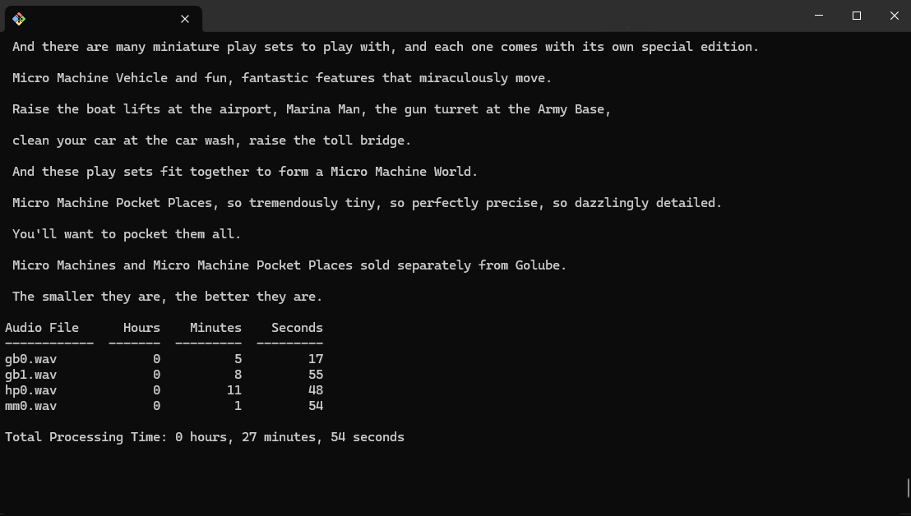
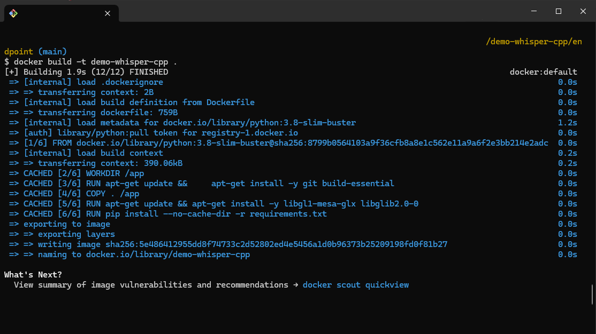
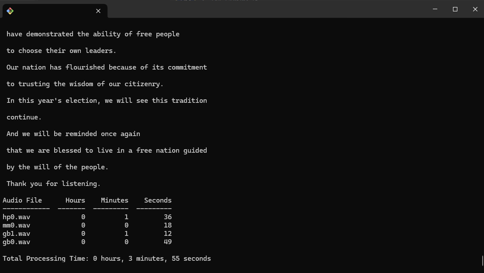

# 🤖 Whisper Text Transcription

This Python script utilizes [whisper-cpp](https://github.com/ggerganov/whisper.cpp/) package, which is a custom inference implementation of OpenAI's Whisper model used for transcribing WAV audio files to text. [OpenAI's Whisper model](https://github.com/openai/whisper) is an advanced implementation of Automatic Speech Recognition (ASR). It employs modern deep learning techniques to accurately transcribe human speech into text. Whisper has been trained on a large amount of high-quality audio data, enabling it to recognize a wide range of dialects and accents. Its accuracy and speed make it ideal for real-time transcription applications.

## 🛠️Prerequisites

- [Microsoft C++ Build tools](https://visualstudio.microsoft.com/visual-cpp-build-tools/)
- Python 3.8 or higher
- Docker (optional)

## 🚀 Using Python Script

1. **Set Up a Virtual Environment:**

```bash
python -m venv venv
source venv/Scripts/activate  # On Windows, use `venv\Scripts\activate`
```

2. Install the necessary Python dependencies:

```bash
pip install -r requirements.txt
```

3. Run the Python script `audio_transcriber.py`. Make sure to replace `audio_files_for_testing/gb0.wav` with the path to your audio file if necessary:

```bash
python audio_transcriber.py
```

This script will transcribe the specified audio file, print the text on the console, and display the time it took to process.


or

4. Run the Python script `batch_audio_transcriber.py` to transcribe all audio files within the directory `/audio_files_for_testing`.

```bash
python batch_audio_transcriber.py
```

This script will transcribe the all audio file, print the text on the console, and display the time it took to process.



## 🐳 Using DockerFile for the script

1. Build the Docker image named `Dockerfile`:

```bash
docker build -t demo-whisper-cpp .
```



2. Execute the python container from outside it

```bash
docker run demo-whisper-cpp
```


**_Results_**


or

3. Get into the docker container:

```bash
docker run -it --rm demo-whisper-cpp bash
```

3. Execute the python script inside the container

```bash
python batch_audio_transcriber.py
```

This will execute the Python script inside the Docker container, transcribe the audio file, and save the results to `transcription_result.txt`.



## ℹ️ Additional Notes

- Ensure that the audio file path specified in the script is correct and accessible.
- The Docker image can be used to run the transcription in an isolated environment without worrying about dependencies.

## 🧑🏻‍💻 Using the Fast API Endpoint

1. Set Up a Virtual Environment:

```bash
cd endpoint
python -m venv venv
source venv/Scripts/activate  # On Windows, use `venv\Scripts\activate`
```

2. Install Dependencies:

```bash
pip install -r requirements.txt
```

3. Run the FastAPI Application:

```bash
uvicorn transcription_endpoint:app --reload
```

This will start the FastAPI application, and you can access the endpoint at `http://127.0.0.1:8000/docs#/default/transcribe_audio_transcribe_audio__post`.

4. **Results**


## 🕵️ Audio File Testing on 6CPU cores / 16GB Local Machine

1. All audios:

**_Comparative table_**

(Run with docker)

| Audio File | Hours | Minutes | Seconds |
| ---------- | ----- | ------- | ------- |
| gb0.wav    | 0     | 0       | 4       |
| gb1.wav    | 0     | 0       | 4       |
| hp0.wav    | 0     | 0       | 32      |
| mm0.wav    | 0     | 0       | 47      |


